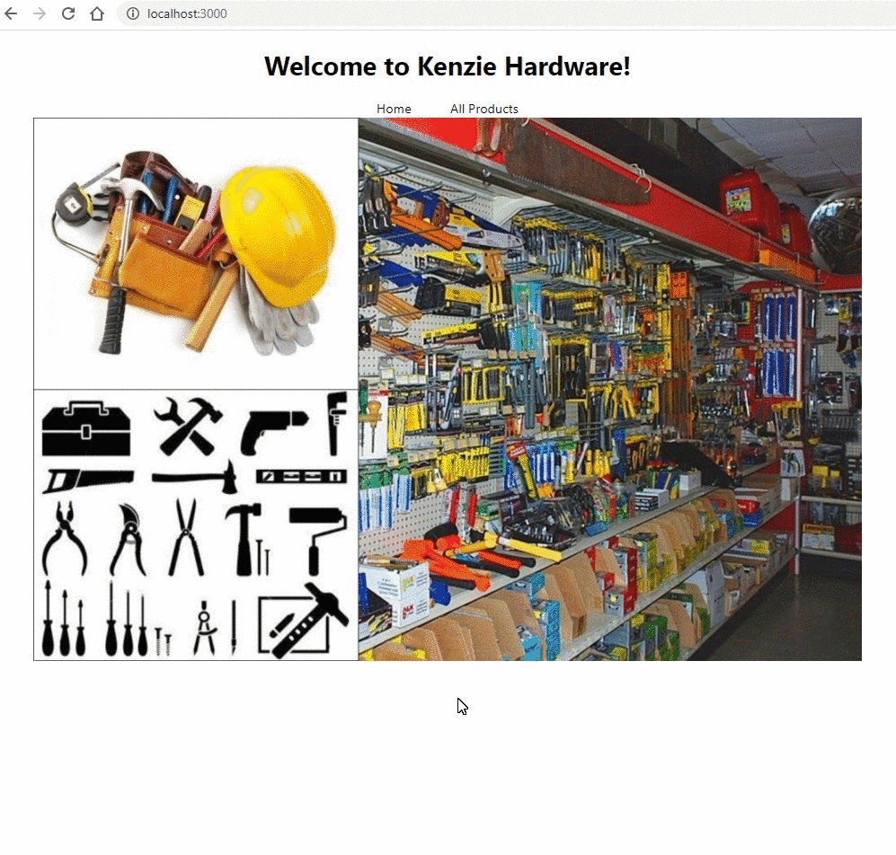

# Hardware Store

Your goal today is to get the navigation working on the Kenzie Hardware Store.

## Getting Started

Run `npm install` to install the dependencies. Then `npm start` the app and take a look at the site. The base navigation is already set up for you. You can navigate between the Products page and the Home page. On the product list, however, clicking on a product does not open the product detail page. Complete the navigation for opening the product detail page.

### 1. Add a new Switch and Route inside the ProductList

The `ProductDetail` page will be a sub route underneath the `ProductList` page. The `ProductList` is at the path `/products` Create a new `Switch` element in `ProductList`. Inside that, put a `Route` with the path `/products` Put all of the ProductList jsx inside of that.

### 2. Add a route for the Product Detail page

Inside the switch, but before the `/products` route, create another route. Set the path to `/products/detail/:productId` This will create a sub page underneath the products page, where the product Id is in the URL. Inside the Route, add a `ProductDetail` component. In order for the product detail component to get the Product object, you will need to pass it the product list as a prop.

### 3. Add a Link to `ProductSummary` to the products detail page.

To navigate to the product's detail page, you will need to import and create a Link on the `ProductSummary` page. Set the `to` prop on the `Link` component to `{"/products/detail" + props.product.id}`

### 4. Now open the `ProductDetail` component and Initialize the state

Your `ProductDetail` component's state needs to have the `product` object. To do this, create a `useEffect` hook. This useEffect hook should find the current product from the product list. Then, it should set the current product in state to the product object that matches the id from the dynamic URL. Currently, the product id is in the URL! It is passed to the component via `props.match` from BrowserRouter. You can access that value with `props.match.params.productId`

💡 Hint: You can either loop through the productList and find the object with the matching id, or the `.find()` function is very useful here! If you use the find function, you will need to handle the case where the product is not found, and you need to return an empty object `{}`. The easier way to do this is with `|| {}` at the end of the expression. For example:

```
let myObject = myArray.find(item => item.id === idYouAreLookingFor) || {};
```

If the item is found, then this will return the item, if it is not then it will return `{}`

### 5. Add more functionality to the product list.

If you look at the data model in App.js, there are some extra properties there:

```
{
  id: 1,
  name: "Wrench",
  price: "11.50",
  description: "Standard 3/16 Wrench.  Stainless Steel.",
  quantity: 5,
  department: "tool",
},
```

Every item has a quantity and a department. Using these fields, you can filter the items in the product list.

- If any product is out of stock, put a message on that item in the list. Something like "Out of Stock" instead of displaying a price.
- Add functionality to filter the product list based on the 3 different departments: tool, hardware, and garden.

💡 Hint: Look into the `.filter()` [method](https://developer.mozilla.org/en-US/docs/Web/JavaScript/Reference/Global_Objects/Array/filter)

# Requirements

- Clicking a Product in the list opens the ProductDetail Page which displays the item information
- Out of stock items display "Out of Stock" instead of the price.
- You can filter the products by department

# Example Output



# Credits and References

Author: Billy Yip, Alex Mourtos, Abdael Mora, Gwen Faraday(her video helped alot)

References: Gwen's filter demo video(https://kenzie.zoom.us/rec/play/mUQT_HIS1mxLlWum4cf8jycRQuiSTpqFpboFEOxicj6oMsSyeapJB9aqGj16SqYTBmFPLaUB38cSSYr2.WePhEDwf4oDcFZeY?continueMode=true&_x_zm_rtaid=bbdH1DZDQ-uYsdLxUsO_kg.1614723860511.dbfaeb003e16801cc54d1d2b7ebeb67c&_x_zm_rhtaid=792)
